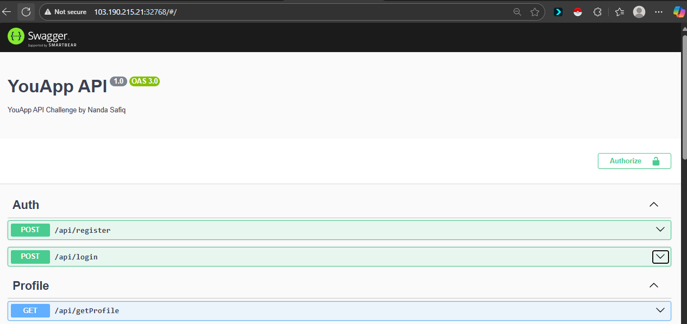
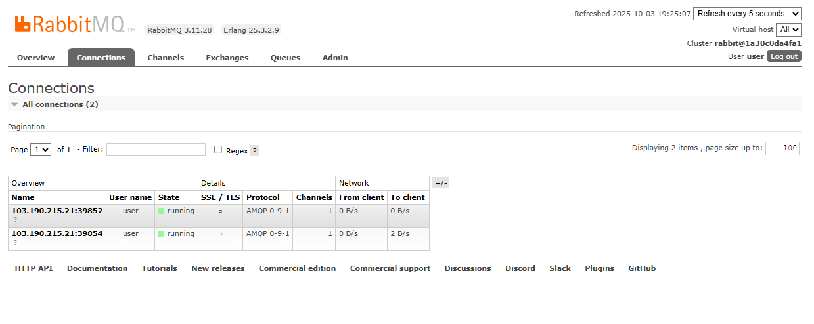
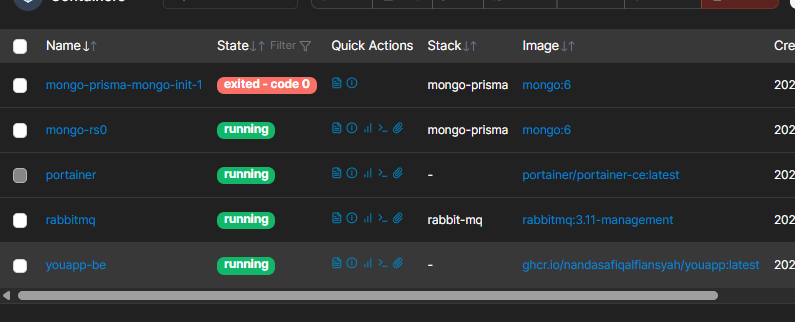
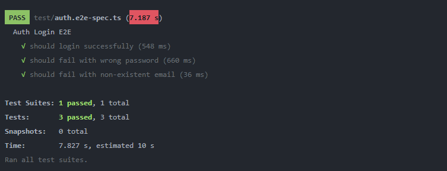

# 🚀 YouApp API

<p align="center">
  <a href="http://nestjs.com/" target="_blank">
    
  </a>
</p>

<p align="center">
  A scalable <a href="http://nodejs.org" target="_blank">Node.js</a> API built with 
  <a href="http://nestjs.com/">NestJS</a>, using MongoDB, RabbitMQ, and JWT authentication.
</p>

<p align="center">
  <a href="https://github.com/your-username/youapp-api/actions" target="_blank">
    
  </a>
  <a href="https://www.npmjs.com/" target="_blank">
    
  </a>
  <a href="https://www.mongodb.com/" target="_blank">
    
  </a>
  <a href="https://www.rabbitmq.com/" target="_blank">
    
  </a>
  <a href="https://opensource.org/licenses/MIT" target="_blank">
    
  </a>
</p>

---

## 📖 Overview

**YouApp API** is a backend service built with **NestJS**.  
This project is designed to be **scalable** and supports several key features:

| Feature | Description |
|---------|-------------|
| 🔐 Authentication | Using **JWT** |
| 🗄 Database | **MongoDB** |
| 📨 Message Broker | **RabbitMQ** (for notifications & chat) |
| 🐳 Containerization | **Docker support** |
| ⚡ CI/CD | **GitHub Actions** |

---

## 📸 Screenshots

### API Documentation


### RabbitMQ Dashboard


### Portainer (Docker Management)


### Test Coverage


---

## ⚙️ Project Setup

```bash
# Install dependencies
$ yarn install
```

---

## 🏃 Running the Project

```bash
# Development
$ yarn start

# Watch mode
$ yarn start:dev

# Production mode
$ yarn start:prod
```

---

## 🧪 Testing

```bash
# Unit tests
$ yarn test

# E2E tests
$ yarn test:e2e

# Coverage
$ yarn test:cov
```

---

## 🐳 Docker

### Build & Run

```bash
# Build image
$ docker build -t youapp-api .

# Run container
$ docker run -d -p 3000:3000 --env-file .env youapp-api
```

### Docker Compose

Use `docker-compose.yml` to run with other services (MongoDB, RabbitMQ, etc):

```bash
$ docker-compose up -d
```

---

## 🔑 Environment Variables

Create a `.env` file based on the following template:

```env
DATABASE_URL=mongodb://<username>:<password>@<host>:<port>/<dbname>
JWT_SECRET=your_jwt_secret
RABBITMQ_URL=amqp://<username>:<password>@<host>:<port>/<vhost>
```

---

## 🚀 Deployment

This project is built & pushed to **GitHub Container Registry (GHCR)** via GitHub Actions.

```bash
ghcr.io/<your-username>/youapp-api:latest
```

---

## 👨‍💻 Author

* **Nanda Safiq Alfiasyah**
* Framework: [NestJS](https://nestjs.com)

---

## 📜 License

This project is [MIT licensed](LICENSE).

---

## 📞 Contact

If you have any questions or issues, please create an issue in this repository.